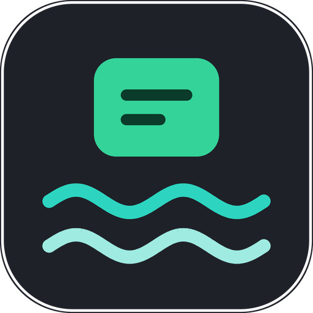

<p align="center"></p>

<h1 align="center">Ebb</h1>

<p align="center">Заметки, которые уходят из головы и сами возвращаются.<br>Спокойный слой памяти на втором мониторе Windows.</p>

---

Ebb заменяет разбросанные Sticky Notes: идеи, prompts, ссылки, цели и напоминания лежат
стеклянными карточками на отдельном мониторе — под окнами, не на панели задач. Записали,
перестали держать в голове, а Ebb вернёт нужное в поле зрения.

**Capture → Forget → Resurface → Act → Archive**

## Возможности

- Слой карточек на выбранном мониторе, акрил, перетаскивание и изменение размера по сетке.
- Быстрый захват из любого приложения — `Win+Alt+N`, типы и `#теги` прямо в тексте.
- Мгновенный поиск (SQLite FTS5) — `Win+Alt+F`, архив и корзина — `Win+Alt+L`.
- Импорт открытых Windows Sticky Notes так, как они лежат на экране.
- Трей, один экземпляр, автозапуск при входе без задержки Explorer.

Если сочетание занято другой программой, Ebb берёт следующее свободное (`Ctrl+Alt+N`, …) —
актуальное видно в меню трея.

## Установка

Скачайте последний [релиз](https://github.com/Gerrux/ebb/releases/latest):

- `Ebb-Setup-x.y.z.exe` — установщик, без прав администратора;
- `ebb-x.y.z-windows-x64.zip` — портативный `ebb.exe`.

Нужна Windows 10 1809+ (лучше Windows 11). Заметки хранятся в `%LOCALAPPDATA%\Ebb\ebb.db`.

## Сборка

```powershell
cargo build --release                      # target\release\ebb.exe
powershell -File installer\build.ps1       # + dist\Ebb-Setup-*.exe и zip (нужен Inno Setup 6)
```

Командная строка: `ebb --quit`, `ebb --autostart-on|off|status`.

Иконка генерируется `python scripts/make-icon.py` (Pillow) в `assets/`.

## Выпуск

1. Поднять `version` в `Cargo.toml`, закоммитить.
2. `git tag vX.Y.Z && git push origin vX.Y.Z` — workflow `release` соберёт установщик и
   опубликует релиз.

Дальнейшие планы — в [docs/specs](docs/specs/README.md).
